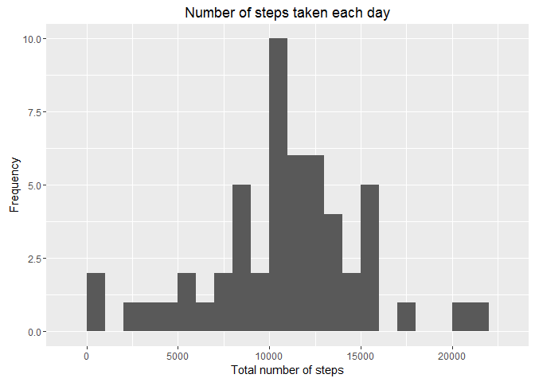
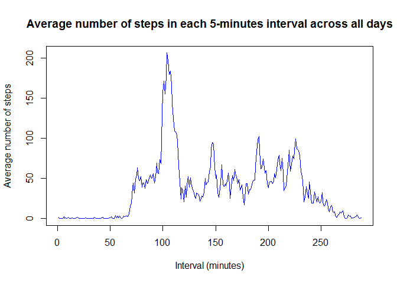
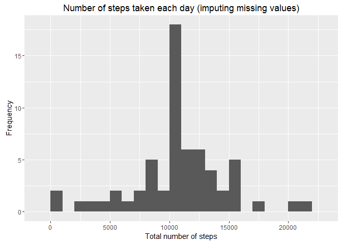
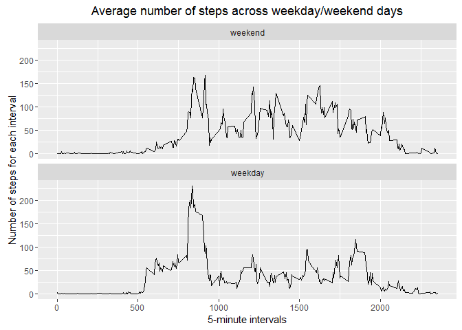

# Reproducible Research: Peer Assessment 1
Rafael Hierro  
April 22nd, 2016  

# Introduction

This exercise is part of the Reproducible Research Course, Peer Assesment 1,from Johns Hopkins University,
in Coursera website.

The objective is to write a report asnwering the questions detailed in the assigment instructions,
using an R markdown document that can be processed and transformed into an HTML file.

This assignment makes use of data from a personal activity monitoring device. This device collects 
data at 5 minute intervals through out the day. The data consists of two months of data from an 
anonymous individual collected during the months of October and November, 2012 and include the 
number of steps taken in 5 minute intervals each day.

The raw data is included in the repository.

The variables included in this dataset are:

- steps: Number of steps taking in a 5-minute interval (missing values are coded as NA)
- date: The date on which the measurement was taken in YYYY-MM-DD format
- interval: Identifier for the 5-minute interval in which measurement was taken


```r
Rversion <- version$version.string
```

R version 3.2.3 (2015-12-10)

Also, as I am going to used the ggplot2 plotting system throuhg the assignment, I will load the library.


```r
library(ggplot2)
```


# Loading and preprocessing the data

First of all, let´s unzip the file and load the data into a variable in R.


```r
unzip(".//repdata-data-activity.zip")

monitoring_data <- read.csv("activity.csv")
```

Let´s see the first lines of the dataset we have


```r
head(monitoring_data, 10)
```

```
##    steps       date interval
## 1     NA 2012-10-01        0
## 2     NA 2012-10-01        5
## 3     NA 2012-10-01       10
## 4     NA 2012-10-01       15
## 5     NA 2012-10-01       20
## 6     NA 2012-10-01       25
## 7     NA 2012-10-01       30
## 8     NA 2012-10-01       35
## 9     NA 2012-10-01       40
## 10    NA 2012-10-01       45
```


# What is mean total number of steps taken per day?

For this part of the assignment I will ignore the missing values in the data.

First we will calculate the total number of steps taken per day, showing the first rows of 
the new dataset.


```r
steps <- aggregate(steps ~ date,monitoring_data, sum, na.rm = TRUE)
head(steps, 10)
```

```
##          date steps
## 1  2012-10-02   126
## 2  2012-10-03 11352
## 3  2012-10-04 12116
## 4  2012-10-05 13294
## 5  2012-10-06 15420
## 6  2012-10-07 11015
## 7  2012-10-09 12811
## 8  2012-10-10  9900
## 9  2012-10-11 10304
## 10 2012-10-12 17382
```

Now, I will show an histogram of the total number of steps taken each day


```r
qplot(steps$steps, 
     binwidth = 1000,
     main = "Number of steps taken each day", 
     xlab = "Total number of steps") +
     ylab("Frequency")
```

\

Now, we calculate the mean and median of the total number of steps taken per day


```r
mean <- format(round(mean(steps$steps), digits = 2), nsmall = 2)

median <- median(steps$steps)
```

The mean of the total number of steps taken per day is 10766.19.

The median of the total number of steps taken per day is 10765.


# What is the average daily activity pattern?

For this question, we will plot the average number of steps taken per interval of 5 minutes, 
averaged across all days.


```r
steps_mean <- aggregate(steps ~ interval,monitoring_data, "mean", na.rm= TRUE)

plot(steps_mean$steps, type = "l", col="blue", 
     xlab="Interval (minutes)", 
     ylab="Average number of steps", 
     main="Average number of steps in each 5-minutes interval across all days")
```

\


```r
max_interval <- steps_mean$interval[which.max(steps_mean$steps)]
```

On average the 5-minute interval across all the days in the dataset containing the maximum number 
of steps is 835. That means that from 8:35 to 8:40 is on average when 
the subject takes more number of steps.


# Imputing missing values

There are a number of days/intervals where there are missing values in the dataset,
which may introduce bias into some calculations or summaries of the data. In the previous questions,
I have ignored them, but in the next sections we will make an strategy for filling them in.

First, let´s calculate the total number of missing values in the dataset


```r
missing_Values <- is.na(monitoring_data)
NA_count <- sum(missing_Values)
```

The number of missing values (NAs) in the dataset is 2304.

As strategy, I have chosen to use the previous calculations we have dont to fill in the missing 
values with the average value for the 5-minute interval across all the days.

I have created a new dataset, replacing the missing values with the mean for that specific interval.
I will show the first rows, were you can see that the missing values have been replaced.


```r
data_NAfilled <- monitoring_data
data_NAfilled[missing_Values, "steps"] <- rep(steps_mean$steps, 
                                              length.out = nrow(monitoring_data))[missing_Values]
head(data_NAfilled, 10)
```

```
##        steps       date interval
## 1  1.7169811 2012-10-01        0
## 2  0.3396226 2012-10-01        5
## 3  0.1320755 2012-10-01       10
## 4  0.1509434 2012-10-01       15
## 5  0.0754717 2012-10-01       20
## 6  2.0943396 2012-10-01       25
## 7  0.5283019 2012-10-01       30
## 8  0.8679245 2012-10-01       35
## 9  0.0000000 2012-10-01       40
## 10 1.4716981 2012-10-01       45
```

To show if there is any difference imputing the missing values or not, we will compare with
the previous sections, showing the histogram and calculating the mean and the median.


```r
steps2 <- aggregate(steps ~ date,data_NAfilled, sum)

qplot(steps2$steps, 
      binwidth = 1000,
      main = "Number of steps taken each day (imputing missing values)",
      xlab = "Total number of steps") +
        ylab("Frequency")
```

\

```r
mean2 <- format(round(mean(steps2$steps), digits = 2), nsmall = 2)

median2 <- format(round(median(steps2$steps), digits = 2), nsmall = 2)
```

As you can see in the histogram, there is a little variation compare to the first one,
and now the mean and the median are the same (which is what it should from the strategy
I have chosen).

Now the mean is 10766.19 and the median is 10766.19.

Conclusion: The means are the same ignoring or imputing the missing values as I filled 
NA values with mean values for intervals. The medians differ only slightly.


# Are there differences in activity patterns between weekdays and weekends?

First of all, as I do not have the system set to English language, I will set the 'Time' to English language,


```r
Sys.setlocale(category = "LC_TIME", "English")
```

```
## [1] "English_United States.1252"
```

For this part, I have create a new factor variable, called "weekdays", in the dataset with two levels 
- "weekday" and "weekend" - indicating whether a given date is a weekday or weekend day.

Let´s see the first observations and the structure from this new dataset


```r
weekend <- c("Saturday", "Sunday")

data_NAfilled$date <- strptime(data_NAfilled$date, "%Y-%m-%d")
data_NAfilled$weekday <- weekdays(data_NAfilled$date)
data_NAfilled$weekday <- factor(weekdays(data_NAfilled$date) %in% weekend, 
                                levels=c(TRUE, FALSE), 
                                labels=c("weekend", "weekday"))

head(data_NAfilled, 10)
```

```
##        steps       date interval weekday
## 1  1.7169811 2012-10-01        0 weekday
## 2  0.3396226 2012-10-01        5 weekday
## 3  0.1320755 2012-10-01       10 weekday
## 4  0.1509434 2012-10-01       15 weekday
## 5  0.0754717 2012-10-01       20 weekday
## 6  2.0943396 2012-10-01       25 weekday
## 7  0.5283019 2012-10-01       30 weekday
## 8  0.8679245 2012-10-01       35 weekday
## 9  0.0000000 2012-10-01       40 weekday
## 10 1.4716981 2012-10-01       45 weekday
```

```r
str(data_NAfilled)
```

```
## 'data.frame':	17568 obs. of  4 variables:
##  $ steps   : num  1.717 0.3396 0.1321 0.1509 0.0755 ...
##  $ date    : POSIXlt, format: "2012-10-01" "2012-10-01" ...
##  $ interval: int  0 5 10 15 20 25 30 35 40 45 ...
##  $ weekday : Factor w/ 2 levels "weekend","weekday": 2 2 2 2 2 2 2 2 2 2 ...
```

Now, I will show a panel plot containing a time series plot of the average number of steps taken each
5-minute interval, averaged across all weekday days or weekend days.


```r
plot_weekday <- ggplot(data_NAfilled, aes(interval, steps)) +
        facet_wrap(~weekday, nrow = 2) +
        stat_summary(fun.y = "mean", geom = "line") +
        xlab("5-minute intervals") + ylab("Number of steps for each interval") +
        labs(title=expression("Average number of steps across weekday/weekend days"))

print(plot_weekday)
```

\

As you can see in the plot, the number of steps varies slightly from weekdays to weekends, 
with more steps in the mornings for the weekdays, but in the afternoon weekends, the subjet
takes more steps on average.
